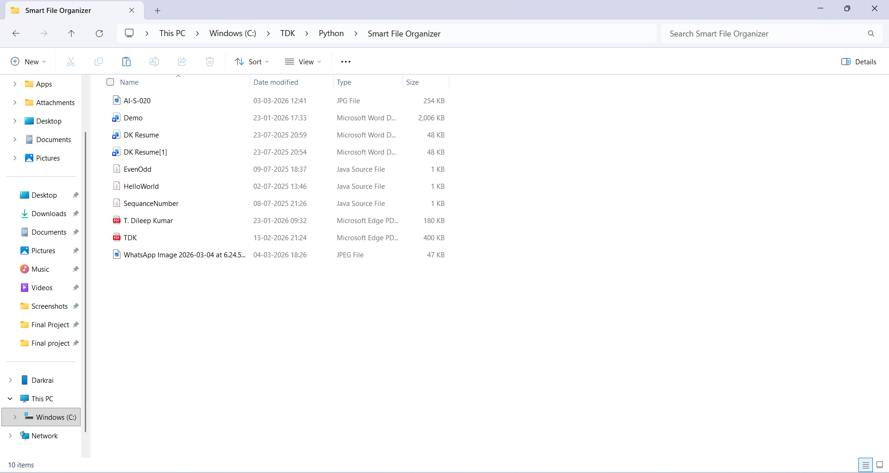
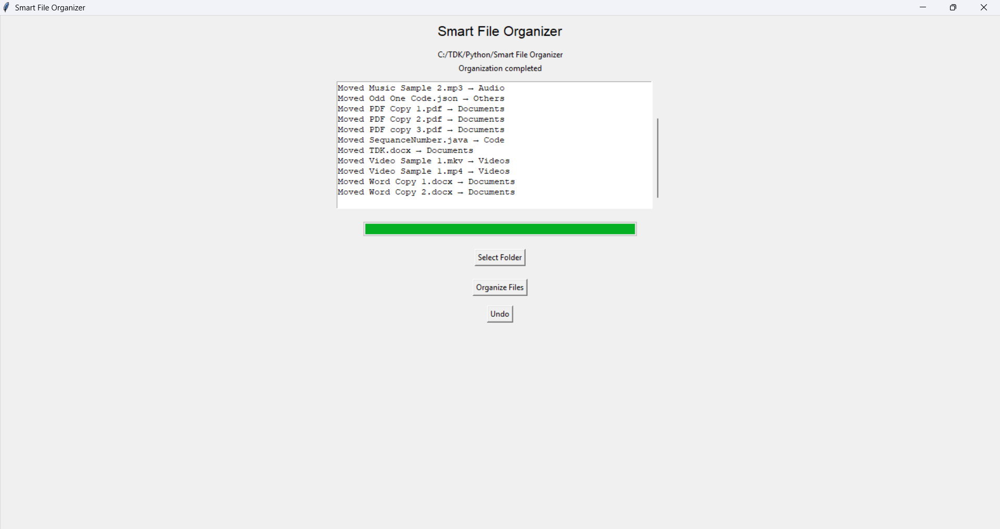
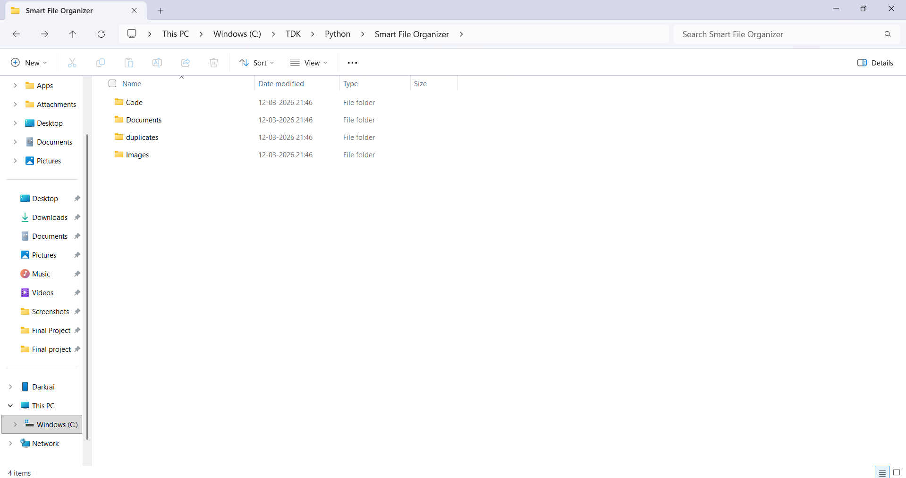

# Smart-File-Organizer

A Python-based file management tool that automatically organizes files into categories based on file type.  
The system provides both a **Command Line Interface (CLI)** and a **Graphical User Interface (GUI)** with features like progress tracking, logging, and undo functionality.

---

## Features

- GUI-based file organizer using Tkinter
- Automatic file categorization by file type
- Duplicate file detection using file hashing (CLI mode)
- Progress bar for tracking operations
- Activity log display in GUI
- Undo functionality to restore original file locations
- Automatic cleanup of empty folders after undo
- Command-line interface support

---
  
## Technologies Used

- Python
- os module
- hashlib
- shutil
- argparse
- logging
- Tkinter

---

## Project Structure

	Smart-File-Organizer/
	│
	├── config.py           # File type category definition
	├── utils.py            # Helper functions(Move, Hash, Category)
	├── organizer.py        # Core logic
	├── undo_manager.py     # Undo system logic
	├── gui.py              # GUI interface
	├── main.py             # Entry point for GUI
	├── requirements.txt
	├── README.md
	├── Screenshots/
	└── .gitignore

---

## Requirements

- Python 3.8 or higher

---

## Installation

Clone the repository and navigate to the project folder:

	git clone https://github.com/TDileepKumar/Smart-File-Organizer.git
	cd Smart-File-Organizer

---

## Usage

**1. GUI Mode:**

Run the following command:

	python main.py
Steps:
1. Select a folder
2. Click **Organize Files**
3. View progress and activity logs
4. Use **Undo** to restore files if needed

**2. CLI Mode:**

Run the following command:

	python organizer.py --path "Folder_Location"
	
#### For Example:

	python organizer.py --path "C:\Users\User\Downloads"

---

## Example

Before Organizing:

	Downloads/
		photo.jpg	
		report.pdf	
		script.py

After Organizing:

	Downloads/
		Images/    
			photo.jpg	   
		Documents/    
			report.pdf	   
		Code/    
			script.py

---

## Architecture

	Input Folder
		│	
		▼
	organizer.py
		│
		├── get_file_hash()
		├── get_category()
		└── move_file()
		│
		▼
	Categorized Folders
	(Images / Documents / Code / Others)

---

## Demo
Before Organizing:

GUI Interface:

After Organizing:

